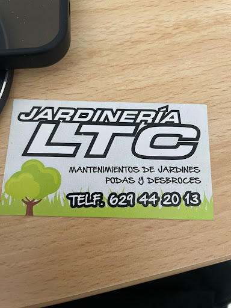

<!DOCTYPE html>
<html lang="es">
<head>
    <meta charset="UTF-8">
    <meta name="viewport" content="width=device-width, initial-scale=1.0">
    <title>Jardinería LTC | Mantenimiento y Podas</title>
    
</head>
<body>

    <header>
        
    </header>

    

        <h2 style="font-size: 2.5em; margin: 0;">Profesionales del Jardín</h2>
        
Calidad, seriedad y los mejores precios

    

    <section class="servicios">
        
<h3>🌿 Mantenimiento</h3>
Cuidado de césped, abonado y limpieza general.

        
<h3>✂️ Podas</h3>
Especialistas en recorte de setos y poda ornamental.

        
<h3>🚜 Desbroces</h3>
Limpieza profunda de parcelas y fincas rústicas.

    </section>

    <section style="padding: 60px 20px; background: #f9f9f9;">
        <h2>¿Hablamos de tu jardín?</h2>
        
Llama directamente al <strong>629 44 20 13</strong> o escríbenos:

        <a href="https://wa.me/34629442013" class="btn-whatsapp">Pedir presupuesto GRATIS</a>
    </section>

    <footer style="padding: 30px; color: #999;">&copy; 2024 Jardinería LTC</footer>

</body>
</html>
